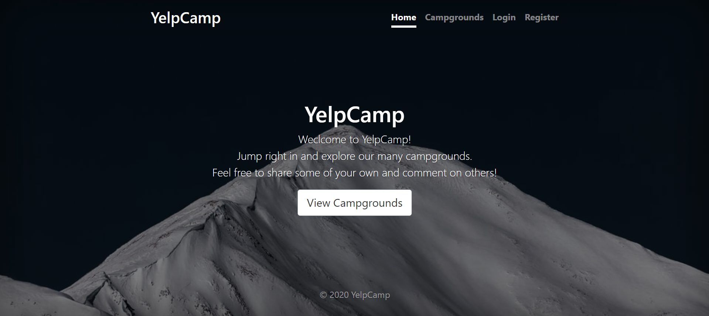
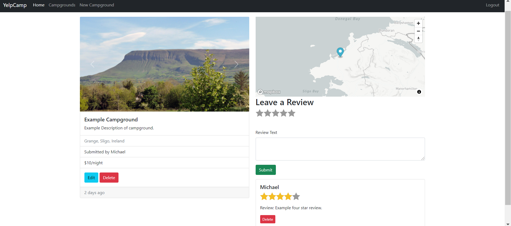
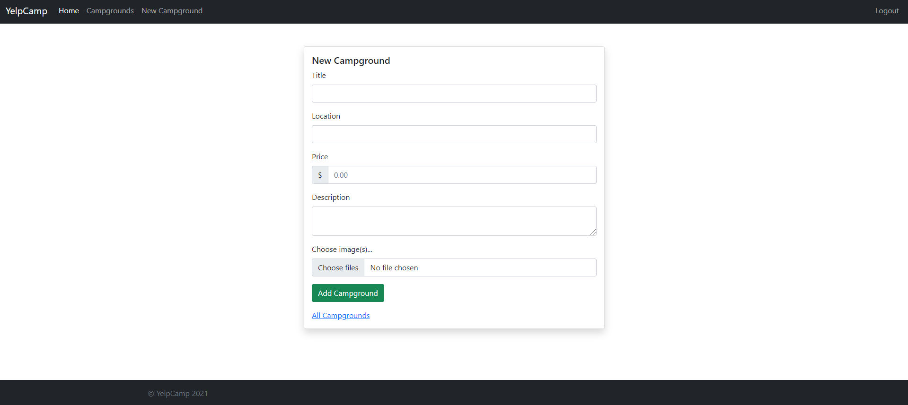

# Yelp Camp

---

Deployed using Heroku: https://yelp-camp-220284.herokuapp.com/

---

### About
Proof of concept website undertaken as the main code-along to Colt Steele's 'The Web Developer Bootcamp' course on the Udemy platform. 
Yelp Camp is a simple camping reviews website, based on the concept of Yelp. The central purpose was to implement full CRUD functionality into a user friendly website designed using Bootstrap. Yelp Camp also makes use of Mongo databasing, Cloudinary Maps, and many other middlewares to boost security, error handling, and user experience. 

All credit belongs to Colt Steele for his exceptional course, it is again stressed that this application is a code-along to Colt's videos. 

--- 

---

---

---
